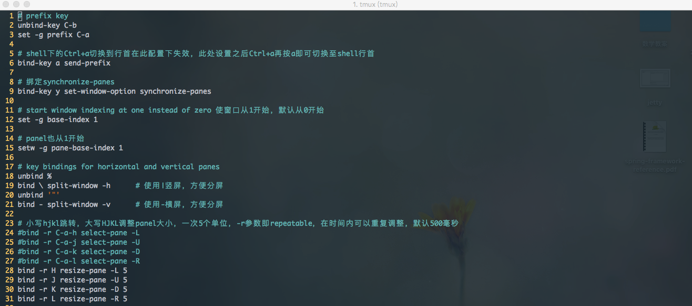

## tmux的简单配置

### tmux.conf

Powerline需要安装patch过的字体，下载地址为：[powerline fonts](https://github.com/powerline/fonts);  
此外，需要配置iterm的Non-ASCII Font为powerline字体，如：Dejavu Sans Mono for Powerline。  
`Preferences-->Profiles-->Text-->Non-ASCII Font`

### 示例截图  

